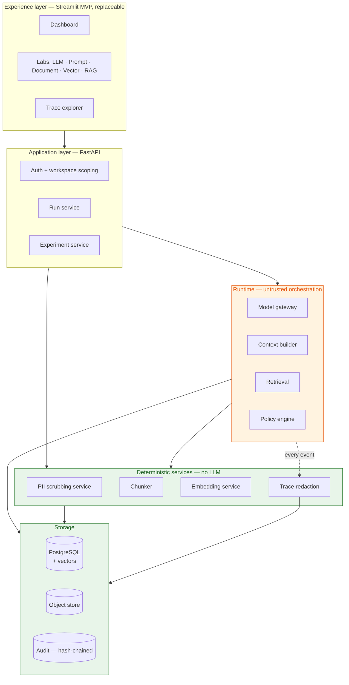
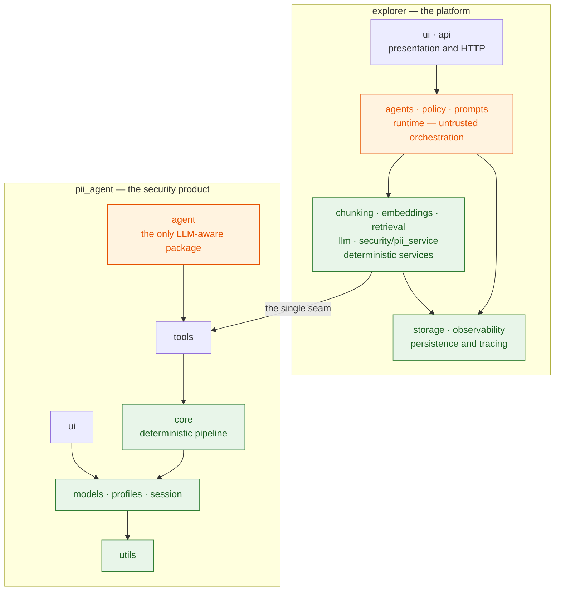
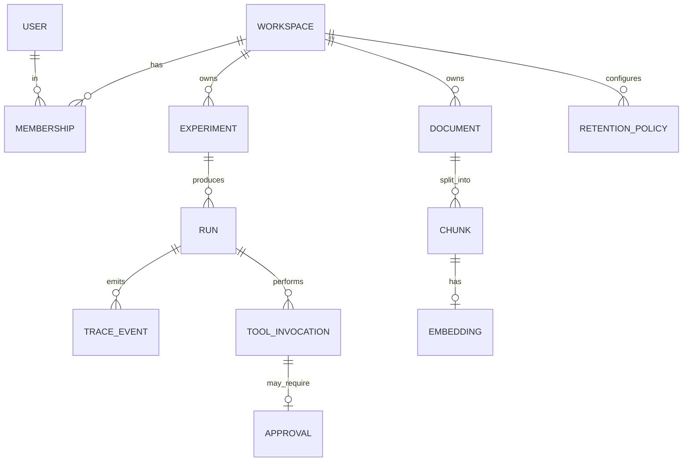
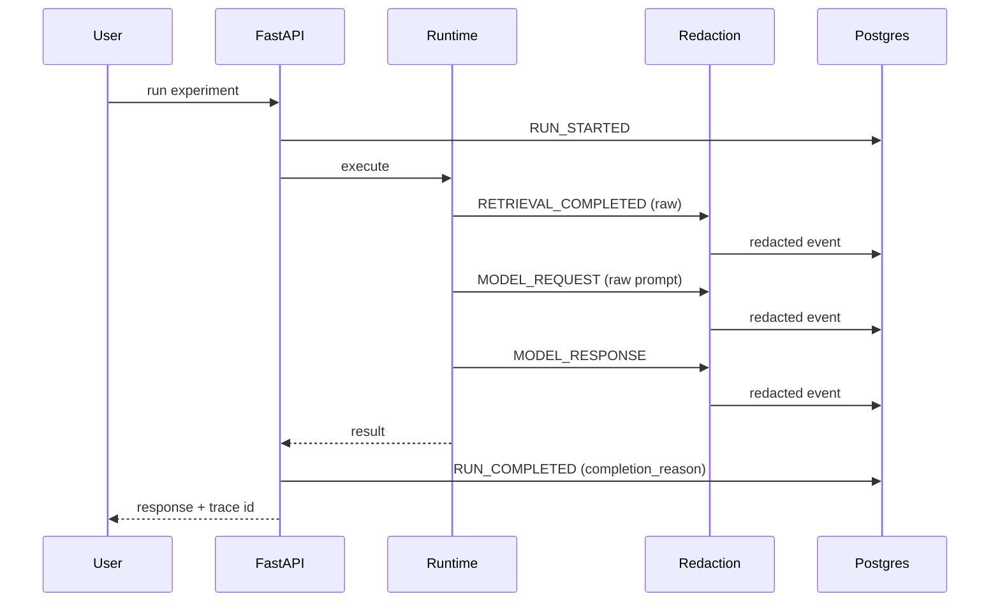
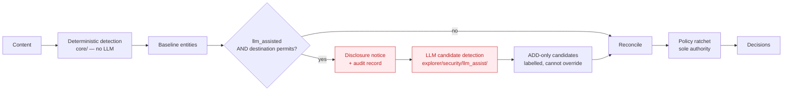
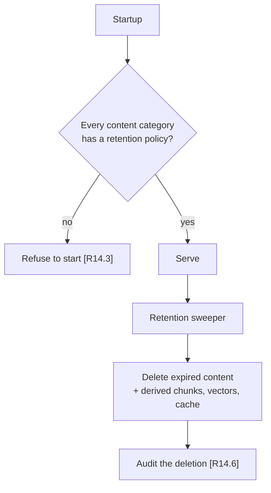

# Design Document

GenAI Architecture Explorer — technical design for the MVP (Deliverables 1–5 plus
the pulled-forward prerequisites), with later phases sketched only where they
constrain MVP structure.

Requirements referenced as `[R4.7]` meaning Requirement 4, criterion 7.

## Overview

The platform is a set of observable, configurable modules over a shared runtime. The
MVP delivers the path from a raw model call through document processing, embedding,
retrieval and answer generation, with the existing PII Scrubbing Agent exposed as a
reusable security service — and with every step of that path recorded as an
inspectable trace.

The design's centre of gravity is not the features but the boundaries: which
component may see content, which may decide an action, and which may write to
storage. Those boundaries are what allow a learning platform to also be a
defensible one.

### Guiding constraints

Three constraints shape every decision below. They are not negotiable within this
design, and each one closes off options that would otherwise look attractive.

**The model is untrusted.** Inherited from the PII agent and generalised to the
platform. Untrusted data — user input, retrieved chunks, tool output, third-party
responses — is structurally separated from instructions `[R17.1, R17.2]`. Tool
actions are validated independently of the text that proposed them `[R7.7]`.

**Deterministic first, frameworks second.** The platform exists to make mechanisms
visible, so the first implementation of each mechanism is direct and readable.
Third-party layers arrive as *comparison adapters*, not as the implementation
`[BRD section 25]`. This is why exact vector search precedes `pgvector` and why a
memory layer such as mem0 is deferred to an adapter.

**Redact before persist, not before display.** Trace and log redaction happens on
the write path `[R6.8]`. Redacting at render time leaves the raw value in the
store, which is where a breach reads from.

---

## Architecture



The orange boundary is the untrusted region. Note the trace path: every event from
the runtime passes through redaction before reaching storage, which is the
structural form of `[R6.8]`.

### Layered architecture

The platform is two products in one repository, each internally layered, joined by
exactly one seam. Dependencies point downward only; an import that goes upward is a
design error and is caught by test.



#### Dependency rules, enforced by test

| # | Rule | Rationale |
|---|---|---|
| D1 | `pii_agent.*` imports nothing from `explorer.*` | The security product stays independently deployable and independently trustworthy. If it cannot ship alone, its guarantees are the platform's problem too |
| D2 | `explorer.*` reaches `pii_agent` only through `explorer.security.pii_service` | One contract, one place to change, one place to review |
| D3 | `pii_agent.core` imports no LLM library | Existing `sys.modules` subprocess assertion. **Property 1** |
| D4 | `pii_agent.core` imports nothing from `pii_agent.agent` or `pii_agent.tools` | Keeps the reasoning loop out of the data path — the finding that drove the original architecture review |
| D5 | `explorer` deterministic services import nothing from `explorer.agents` or `explorer.llm` | Same reasoning, applied to the platform. A chunker that can call a model will eventually call one |
| D6 | `explorer.observability.redaction` sits on the write path of every trace event | **Property 11** |
| D7 | No package imports a `ui` package | Presentation is a leaf. Anything a UI needs that logic also needs belongs in the layer below |

Rules D1, D2, D4 and D5 are checkable by static import inspection. The design
includes a single test that walks the AST of every module and asserts the direction
of every import, so a violation fails the suite rather than being noticed in review
three months later.

### Repository structure

**Decision: restructure. Both products become top-level packages, and non-code
artifacts leave the root.**

This reverses an earlier draft of this document, which argued for leaving the PII
agent in place because a rename would touch the imports of 966 tests. That reasoning
was backwards. A mechanical rename verified by 966 tests — including the ones
asserting the security properties — is among the safest refactors available; the
tests are the safety net, not the hazard. Left alone, the root would hold eight
existing packages plus fifteen new ones with no signal about which belongs to what.

Current state: eight Python packages and seventeen loose files at the root, with
runtime data (`audit/`, `scan_workspace/`), generated dashboards, sample data and a
source `.docx` all mixed in.

Target:

```
c:/AI/
├── pyproject.toml              tool config, pytest paths, coverage gates
├── requirements.txt            exact-pinned (unchanged policy)
├── conftest.py
├── README.md  LICENSE  .env.example  .gitignore
│
├── pii_agent/                  ← the security product
│   ├── utils/                  config, paths, normalization, budgets, content_gate
│   ├── models/                 entities, decisions, results, coverage, enums
│   ├── session/                context, content_store, token_vault, audit_sink
│   ├── profiles/               policy as YAML + schema validation
│   ├── core/                   pipeline, detectors, reconciler, policy, applier, verifier
│   ├── tools/                  the six coarse agent tools
│   ├── agent/                  LangGraph loop, prompts, memory  ← LLM lives here
│   └── ui/                     presenters + streamlit render
│
├── explorer/                   ← the platform
│   ├── storage/                postgres, object store, migrations, retention sweeper
│   ├── observability/          trace events, redaction middleware, completion reasons
│   ├── llm/                    model adapters, pricing tables
│   ├── prompts/                templates, assembly, versioning
│   ├── chunking/               strategies
│   ├── embeddings/             providers
│   ├── retrieval/              vector adapters (exact, pgvector), RAG pipeline
│   ├── security/
│   │   ├── pii_service/        the typed contract — the only seam to pii_agent
│   │   └── llm_assist/         opt-in disclosure path, deliberately outside pii_agent.core
│   ├── policy/                 risk classification, approval gating
│   ├── tools/                  general tool contract + registry
│   ├── agents/                 runtime            (deferred)
│   ├── memory/                 memory types       (deferred)
│   ├── evaluation/             datasets, metrics  (deferred)
│   ├── api/                    FastAPI app
│   └── ui/                     presenters + streamlit render
│
├── apps/
│   ├── pii_agent_app.py        streamlit entry — the product still runs alone
│   └── explorer_app.py         streamlit entry — the platform
│
├── tests/
│   ├── pii_agent/              unit · security · property · integration · fixtures
│   ├── explorer/               mirrors explorer/ package for package
│   └── architecture/           the import-direction test enforcing D1–D7
│
├── docs/
│   ├── *.md                    published documentation
│   ├── dashboards/             generated HTML
│   └── source/                 the BRD .docx and its extraction
│
├── data/samples/               sample.txt, large.txt — demo input, not fixtures
├── var/                        runtime, gitignored: audit/, scan_workspace/, tmp/
├── tools_dev/                  developer scripts
└── .kiro/  .github/  .streamlit/  .devcontainer/
```

Four properties this buys:

- **The root answers "what is this?"** Two product packages, an entry point
  directory, tests, docs. Nothing else competes for attention.
- **Tests mirror source.** `tests/explorer/retrieval/` maps to
  `explorer/retrieval/`, so the question "is this covered?" is answered by looking
  in the obvious place.
- **Runtime data is separable from source.** `var/` is one gitignore line and one
  directory to wipe, rather than two directories to remember.
- **The seam is visible in the filesystem.** `explorer/security/pii_service/` is the
  only path where the two products meet, which makes rule D2 reviewable by looking.

Deliberately not adopted: a `src/` layout, and a `shared/` package. `src/` is the
better convention but requires an editable install before anything runs, and this
project's ability to be cloned and started with two commands has value. A `shared/`
package would become the place coupling hides — if `explorer` and `pii_agent` ever
genuinely need common code, moving it is a decision worth making explicitly rather
than a directory that invites it.

#### Migration plan

Mechanical, and verified at each step by the existing suite. Ordered so that the
riskiest change is isolated.

| Step | Action | Verification |
|---|---|---|
| 1 | `git mv` the eight packages under `pii_agent/`, add `pii_agent/__init__.py` | Imports fail loudly — expected |
| 2 | Rewrite the eight import prefixes (`from core.` → `from pii_agent.core.`, etc.) across source and tests | 966 tests pass |
| 3 | Update the no-LLM subprocess test's expected module names | **Property 1** still asserted, now against `pii_agent.core` |
| 4 | Move `app.py` to `apps/pii_agent_app.py`; add `pyproject.toml` with `pythonpath` | `streamlit run apps/pii_agent_app.py` works |
| 5 | Move `audit/` and `scan_workspace/` under `var/`; update `.env.example` and `.gitignore` | Startup validation passes |
| 6 | Move samples to `data/samples/`, dashboards to `docs/dashboards/`, BRD to `docs/source/` | Docs build script updated |
| 7 | Update `.kiro/steering/project.md`, `README.md`, `HANDOFF.md`, `docs/*` for new paths | Manual review |
| 8 | Add `tests/architecture/test_import_direction.py` enforcing D1–D7 | New test passes; violations fail |
| 9 | Create `explorer/` skeleton with `__init__.py` files only | Import test covers it from the start |

Step 3 is the one to watch. The test asserting `pii_agent.core` imports no LLM
library is the single most important test in the repository, and a rename is exactly
the kind of change that can leave it passing while asserting nothing. It should be
verified by deliberately breaking it — add an LLM import, confirm the test fails,
remove it.

Step 8 before step 9 is intentional. Adding the enforcement test before the new
packages exist means `explorer/` grows under the rules from its first commit, rather
than acquiring violations that then need unpicking.

---

## Data Models

### Why PostgreSQL, and what goes elsewhere

`[R14.1]` requires every persisted category to be classified. The classification
drives placement:

| Category | Contains sensitive data | Store | Retention driver |
|---|---|---|---|
| Content — documents, chunks, sanitized artifacts | Yes | Object store, referenced from Postgres | `[R14.4]` independently configurable |
| Vectors | Yes — inversion recovers source text `[R4.8]` | Postgres | Follows the content it encodes |
| Derived metadata — counts, scores, offsets, entity types | No | Postgres | Long |
| Configuration — experiments, templates, policies, price tables | No | Postgres | Indefinite |
| Telemetry — trace events | Redacted before write `[R6.8]` | Postgres | Medium |
| Audit | No raw values by contract | Append-only hash-chained files | Survives data deletion `[R14.6]` |
| Secrets | Yes | Secret provider / environment | Never persisted by us `[R15.7]` |

Content lives in the object store rather than in Postgres because deletion of a
large artifact should not require a table rewrite, and because `[R14.4]` wants
original documents and sanitized outputs on separate clocks.

The audit trail stays as the existing hash-chained JSONL rather than moving into
Postgres. A row in a database the application can write to is not tamper-evident;
the chain is. And `[R14.6]` requires audit records to outlive the data they
describe, which is simpler when they are not foreign-keyed to it.

### Core tables



Every table carrying data owns a `workspace_id`, and it is not nullable. `[R15.3]`
requires filtering at the query level, so the column exists on the row rather than
being reachable only by join — a join can be forgotten, and a forgotten join is a
cross-tenant read.

| Table | Notes |
|---|---|
| `workspace` | Isolation boundary. Deletion cascades to all owned data `[R14.5]` |
| `user`, `membership` | Role held on the membership, not the user — the same person may be an approver in one workspace and a reader in another |
| `experiment` | Saved lab configuration plus purpose |
| `run` | One execution. Carries `completion_reason` as NOT NULL `[R6.9]` |
| `trace_event` | Ordered by `(run_id, sequence)`. Content already redacted |
| `document`, `chunk` | `chunk` stores offsets into the original document `[R3.7]` |
| `embedding` | Vector, plus `embedding_model` and `embedding_model_version` NOT NULL `[R4.7]` |
| `prompt_template` | Versioned; a run references a specific version `[R2.1]` |
| `tool_invocation`, `approval` | `approval` records approver identity, decision, timestamp, and executed parameters `[R10.4]` |
| `retention_policy` | One row per workspace per content category. Startup refuses if a category is missing `[R14.3]` |
| `price_table` | Versioned model pricing; runs record the version used `[R1.8]` |

### Vector storage: two adapters

**Decision: exact search is the MVP adapter; `pgvector` is the second.**

At the scale of a learning platform — a handbook yields hundreds to a few thousand
chunks — exact cosine over all candidates is single-digit milliseconds.
Approximate-nearest-neighbour indexes exist to trade recall for speed above roughly
100k vectors; below that they are overhead, and they blur the lesson the Vector Lab
exists to teach because recall becomes approximate for reasons the user cannot see.

```python
class VectorStore(Protocol):
    """Both adapters filter by workspace inside the query, never after it."""

    def upsert(self, records: Sequence[EmbeddingRecord]) -> None: ...

    def search(
        self,
        query_vector: Sequence[float],
        *,
        workspace_id: UUID,
        embedding_model: str,          # refused if it differs from stored [R4.7]
        top_k: int,
        score_threshold: float | None = None,
        metadata_filter: Mapping[str, object] | None = None,
    ) -> list[ScoredRecord]: ...

    def delete_by_document(self, document_id: UUID, workspace_id: UUID) -> int: ...
```

The exact adapter computes similarity in SQL over `float8[]`, so the workspace
predicate and the scoring are in one statement. That matters more than speed: it is
the structural form of `[R15.4]`.

`pgvector` then arrives as a second implementation, and the two become a lab
exercise — same corpus, same query, measurable difference in latency and recall.
Requirement 18.2 is satisfied by construction if adding it needs no change outside
`explorer/retrieval/`.

Practical note: `pgvector` is a server extension, so on Windows it implies Docker.
The exact adapter runs against plain Postgres, which keeps MVP development to one
install.

---

## Components and Interfaces

### Model gateway

```python
class ModelAdapter(Protocol):
    def complete(self, request: ModelRequest) -> ModelResponse: ...
    def capabilities(self) -> ModelCapabilities: ...
```

`ModelResponse` carries `input_tokens`, `output_tokens`, `latency_ms`, and
`token_counts_are_estimated: bool`. That last flag exists because `[R1.4]` forbids
presenting an approximation as a measurement — when a provider does not report
usage, the gateway estimates and says so, and the UI labels it inline `[R19.10]`.

#### Cost

Cost is computed from a versioned price table held as YAML under
`explorer/llm/pricing/`, validated on load, with the version recorded on every run
`[R1.8]`. This mirrors the PII agent's profile handling, and for the same reason: a
stored figure whose basis is unknown is not reproducible, and prices change without
notice.

#### Structured output

`[R1.6]` requires schema-validated JSON with validation failure distinguishable
from a model error. Three outcomes, not two: `OK`, `SCHEMA_INVALID` (model replied,
reply did not conform), and `PROVIDER_ERROR`. Collapsing the middle case into a
generic failure is how a prompt problem gets misdiagnosed as an outage.

---

### Trace and observability

#### Event model

Eleven event types `[R6.3]`, each a row in `trace_event` with a JSON payload
already redacted. Events carry `(run_id, sequence, type, started_at, duration_ms,
payload)`.



#### Redaction middleware

One function on the write path, reusing the PII agent's `redact_secret_shapes` and
`shorten_paths` from `utils/content_gate.py` rather than reimplementing them. Where
workspace policy requires it, the payload also passes the PII service `[R9.7]`
before persistence.

`[R2.4]` wants the exact effective prompt visible, and `[R2.5]` requires the UI to
say when redaction altered it. So the redaction step returns a count, and the count
is stored on the event — the trace can then state "3 values redacted" without
holding the values.

#### Completion reasons

`completion_reason` is NOT NULL on `run` `[R6.9]`. Enumerated:
`COMPLETED`, `BUDGET_EXCEEDED`, `LOOP_DETECTED`, `POLICY_BLOCKED`,
`APPROVAL_DENIED`, `APPROVAL_TIMEOUT`, `PROVIDER_ERROR`, `VALIDATION_FAILED`,
`CANCELLED`. A run that ends without one is a bug, and the constraint makes it a
loud bug rather than a blank field.

---

### PII scrubbing service contract

The single seam between platform and PII agent `[R11.1, R11.2]`.

```python
@dataclass(frozen=True)
class ScrubRequest:
    workspace_id: UUID
    actor_id: UUID
    source: TextSource | DocumentRef      # never a raw path from a model
    profile: str                          # DEFAULT_PII, PAYMENT_PCI, ...
    destination: Destination
    requested_action: ScrubAction | None = None   # may only tighten
    llm_assisted: bool = False            # explicit per request [R12.2]
    batch_id: UUID | None = None          # [R11.7]


@dataclass(frozen=True)
class ScrubResponse:
    request_id: str
    status: Literal["OK"] | RefusalReason
    artifact_ref: ArtifactRef | None      # None whenever withheld
    verified_clean: bool
    entity_counts: Mapping[str, int]      # types and counts, never values
    severity_counts: Mapping[str, int]
    action_counts: Mapping[str, int]
    coverage_percent: float
    security_findings: SecurityFindings   # non-blocking by contract
    engine_versions: Mapping[str, str]
    llm_assisted: bool
    disclosure: DisclosureRecord | None   # populated only when llm_assisted
```

Four properties the contract preserves deliberately:

- `artifact_ref` is `None` for every refusal, so a caller cannot obtain output from
  an incomplete or unverified scan `[R11.8]`.
- No field can carry an entity value `[R11.5]`. The response is shaped so that
  leaking one would require adding a field, which a reviewer would notice.
- `requested_action` may only tighten. The ratchet stays inside the PII agent's
  policy engine; the platform cannot weaken it `[R12.5]`.
- `llm_assisted` and `disclosure` travel with the result, so a downstream consumer
  can tell a deterministic result from a disclosed one `[R12.6]`.

Batch processing `[R11.7]` is a queue of single requests with per-item status and a
resumable cursor, not a new code path through the pipeline. One scan path means one
set of gates.

---

### LLM-assisted detection

The riskiest requirement in the document, so its design is mostly about
containment.



Design decisions that make the containment structural rather than procedural:

**It lives outside `core/`.** `explorer/security/llm_assist/` imports an LLM
library; `core/` must not `[R11.9]`. Placing it in the platform layer means the
existing `sys.modules` test keeps passing unchanged, and the module boundary is the
enforcement.

**Deterministic detection completes first** `[R12.4]`. The LLM call takes the
baseline as input context — never as something to revise — so a provider outage
degrades to the deterministic result rather than to nothing.

**Candidates are add-only and typed differently.** They arrive with
`ConfidenceSource.LLM_SUGGESTED`, a new member alongside `CALIBRATED` and
`HEURISTIC`. Reconciliation ranks it below both, so an LLM suggestion can never
displace a validator-backed finding — the same precedence machinery that already
stops a spaCy guess beating a checksum-validated IBAN.

**The ratchet is untouched.** LLM output reaches the policy engine as entities, not
as actions `[R12.5]`.

---

### Authentication and isolation

**Decision: session-based authentication with password verification, workspace
scoping on every query. No federation.**

BRD section 7.2 puts enterprise identity federation out of scope, and adding OAuth
to a local-first learning platform would be infrastructure without a learning
outcome. What is needed is real enough: authenticated identity for approvals
`[R10.4]`, roles for tool permissions `[R15.2]`, and isolation that holds
`[R15.3]`.

- Passwords stored with a memory-hard KDF; the KDF and its parameters recorded so
  they can be raised later.
- Sessions server-side with an expiry; the cookie carries an opaque id.
- Role held on `membership` — `reader`, `author`, `approver`, `admin`.
- Every repository method takes `workspace_id` explicitly. No ambient context, no
  thread-local, no "current workspace" global. A parameter that must be passed is
  a parameter a reviewer sees.

The existing non-loopback refusal remains until this exists `[R15.5]`. It is
currently the only thing standing between the filesystem and the network.

#### Isolation testing

`[R15.4]` requires cross-workspace reads to be impossible and asserted by test. The
approach is a matrix test: for every read path — vector search, memory recall,
document fetch, trace view, artifact download — seed two workspaces, authenticate
as a member of one, and assert the other's rows are unreachable. Adding a read path
without adding a row to that matrix should fail the suite.

---

### Retention and deletion



The sweeper mirrors `sweep_idle_sessions` and `sweep_orphan_temp_dirs` in the PII
agent — same pattern, same reasoning: retention that depends on someone
remembering is not retention.

Deletion is cascade-by-design `[R14.5]`. Deleting a document removes its chunks,
its embeddings, its object-store payload and any cached derivative. The audit
record of the deletion survives `[R14.6]`, which is why audit is not
foreign-keyed to the data.

---

### Experience layer

Streamlit for the MVP, structured so replacement is possible `[R19.12]`. The
existing PII agent UI already demonstrates the split that makes that feasible:
`ui/presenters.py` holds presentation logic with no Streamlit import and is
unit-tested; `ui/streamlit_render.py` is the thin drawing layer. The platform
follows the same division.

| Component | Requirement |
|---|---|
| Dashboard — labs, recent runs | `[R19.1]` |
| Lab shell — configuration / execution / inspection panels | `[R19.2]` |
| Trace explorer — reachable from the response itself | `[R19.3]` |
| Comparison view — one layout for quality, latency, tokens, cost | `[R19.5]` |
| Findings and policy views — refusal at success weight | `[R19.9]` |
| Approval centre — deferred with HITL | `[R19.7]` |

Two conventions carried over from the PII agent because they measurably changed how
people read output: a refusal is rendered with the same visual weight as a success
and states what would change it `[R19.9]`; and anything estimated, heuristic,
redacted or degraded is labelled at the point of display `[R19.10]`.

A caution learned the hard way in the PII agent: Streamlit re-executes the script
on file change but does not reload already-imported modules, and
`@st.cache_resource` values survive reruns. Anything cached at construction — a
prompt, a registry, a resolved profile — needs a process restart to take effect.
That belongs in the developer documentation for this platform too, because it
presents as "my change did nothing".

---

## Correctness Properties

Properties that must hold regardless of configuration. Each is a test, not a hope.
Properties 1 to 5 protect the trust boundary, 6 to 9 keep failure closed, 10 and 11
enforce isolation, 12 to 16 keep derived data honest, and 17 keeps the architecture
itself from decaying.

### Property 1: The deterministic PII core imports no LLM library

Asserted by `sys.modules` inspection in a subprocess.

**Validates: Requirements 11.9**

### Property 2: No `ScrubResponse` field can carry an entity value

Leaking one would require adding a field, which review would catch.

**Validates: Requirements 11.5**

### Property 3: LLM-suggested entities never displace a validator-backed finding

Reconciliation ranks `LLM_SUGGESTED` below `CALIBRATED` and `HEURISTIC`, using the
same precedence machinery that already stops a spaCy guess beating a
checksum-validated IBAN.

**Validates: Requirements 12.5**

### Property 4: LLM-assisted detection cannot run when the destination forbids disclosure

Checked before transmission, not after.

**Validates: Requirements 12.8**

### Property 5: A deterministic result is distinguishable from a disclosed one

`llm_assisted` and `disclosure` travel with every response.

**Validates: Requirements 12.6**

### Property 6: A refusal always yields a null artifact reference

Asserted across every refusal reason, so no caller can obtain output from an
incomplete or unverified scan.

**Validates: Requirements 11.8**

### Property 7: Every run row has a non-null completion reason

A database constraint, so a run ending without one is a loud failure rather than a
blank field.

**Validates: Requirements 6.9**

### Property 8: Startup refuses when a content category has no retention policy

An unbounded default is how temporary storage becomes permanent.

**Validates: Requirements 14.3**

### Property 9: Executed approval parameters equal approved parameters

Any difference refuses execution rather than substituting values.

**Validates: Requirements 10.6**

### Property 10: No read path returns rows from another workspace

An isolation matrix covers every read path — vector search, memory recall, document
fetch, trace view, artifact download. Adding a path without adding a row fails the
suite.

**Validates: Requirements 15.4**

### Property 11: Trace events are redacted before they reach storage

The store is asserted never to receive a raw value, because redacting at render time
leaves it where a breach reads from.

**Validates: Requirements 6.8**

### Property 12: Similarity is never computed across embedding models

Cosine distance between two embedding spaces is a number with no meaning.

**Validates: Requirements 4.7**

### Property 13: Chunk offsets refer to the original document

Not to a normalized intermediate — otherwise a citation or a redaction cannot be
located in the source.

**Validates: Requirements 3.7**

### Property 14: Deleting a document removes its chunks, vectors and payload

Cascade by design rather than by remembering.

**Validates: Requirements 14.5**

### Property 15: A deletion audit record survives the data it describes

Which is why audit is not foreign-keyed to content.

**Validates: Requirements 14.6**

### Property 16: Low-entropy types never receive a deterministic surrogate

A deterministic surrogate over an exhaustible value space is reversible by anyone,
which is why `HASH` is already rejected for those types.

**Validates: Requirements 13.3**

### Property 17: Import direction is never violated

A single test walks the AST of every module and asserts dependency rules D1 to D7 —
in particular that `pii_agent` imports nothing from `explorer`, and that `explorer`
reaches `pii_agent` only through `explorer.security.pii_service`. Architecture that
is only documented decays; architecture that fails the build does not.

**Validates: Requirements 18.1, 18.3**

## Error Handling

| Failure | Response |
|---|---|
| Provider unavailable | `PROVIDER_ERROR` completion reason; deterministic paths unaffected |
| Provider returns non-conforming JSON | `SCHEMA_INVALID`, distinct from an outage `[R1.6]` |
| Embedding model mismatch on search | Refused, not silently compared `[R4.7]` |
| Vector store unavailable | RAG lab degrades to reporting; no partial answer presented as complete |
| PII service refusal | Propagated with its reason; artifact withheld `[R11.8]`; findings still shown |
| Retention policy missing | Startup refusal `[R14.3]` |
| Cross-workspace access attempt | Denied and audited; indistinguishable from "not found" so existence is not disclosed |
| Approval parameters differ from approved | Execution refused `[R10.6]` |

The pattern throughout: refuse and explain, rather than degrade quietly. Inherited
from the PII agent's three fail-closed gates, where the reasoning is that a partial
result presented as complete is more dangerous than no result.

---

## Testing Strategy

| Layer | Focus |
|---|---|
| Architecture | Import direction D1–D7 by AST inspection; **Property 17** |
| Unit | Adapters, chunkers, cost calculation, redaction, contract serialisation |
| Contract | `ScrubRequest`/`ScrubResponse` round-trips; no response field can carry a value |
| Security | Workspace isolation matrix `[R15.4]`; redaction before persistence; LLM-assist cannot override deterministic findings; `core/` imports no LLM library |
| Property | Offset preservation through chunking; retention sweep never deletes unexpired data |
| Integration | Document to embedding to retrieval to answer with citations, no LLM in the assertion path where avoidable |
| Golden | Chunking and retrieval snapshots keyed to component versions, following the existing pattern |
| Evaluation | Datasets and metrics per `[R16]`, which are themselves a deliverable |

The existing 966 tests must keep passing unchanged. If a platform change requires
editing a PII agent security test, that is a signal to reconsider the change.

---

## Open questions carried into implementation

1. **LLM-assist provider.** Whether content inspection uses the same provider as
   the platform's model gateway, or a separately governed one. Changes the
   disclosure text in `[R12.3]`.
2. **Retention defaults.** `[R14.3]` requires values; they are policy decisions.
3. **Object store for local development.** MinIO gives S3 compatibility at the cost
   of another container; a filesystem-backed adapter keeps MVP setup to one install.
   Adapter interface makes this reversible, so it can be decided late.
4. **Price table maintenance.** Manual, or fetched. Manual is honest and stale;
   fetched adds a network dependency to cost reporting.
