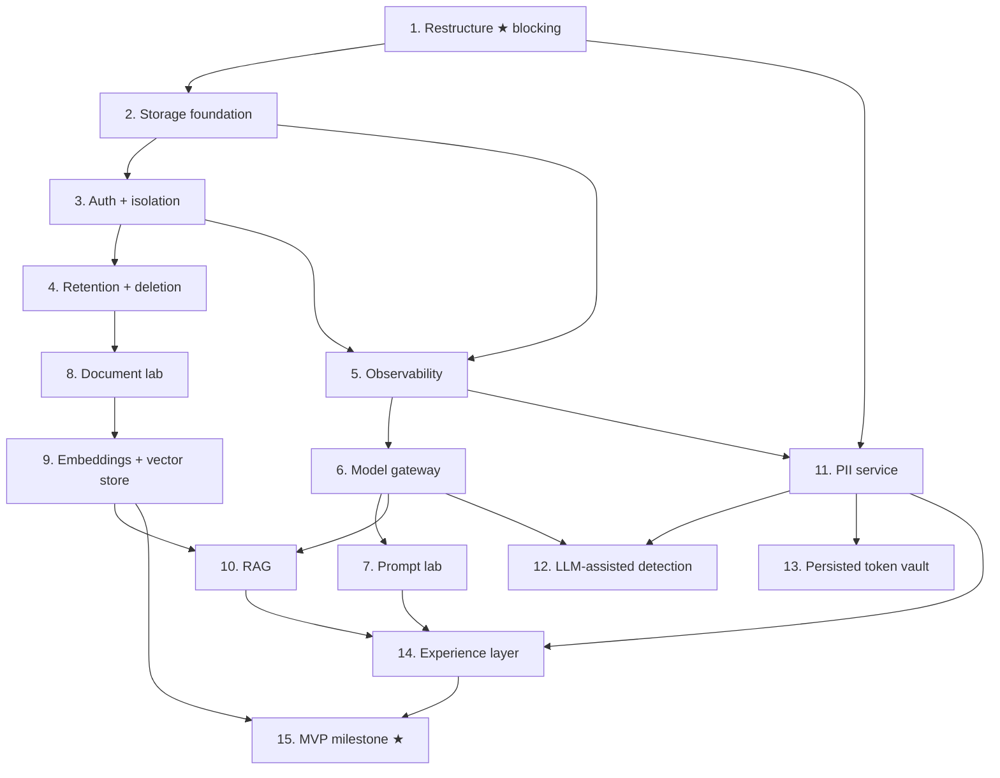

# Implementation Plan

## Overview

This plan builds the MVP boundary from the requirements document — Deliverables 1
to 5 of the BRD, plus the two prerequisites pulled forward (authentication and
retention). It follows the same sequencing principle as the PII agent's plan: the
controls that cannot be retrofitted go first.

Three ordering decisions carry most of the risk reduction.

**The restructure happens first, before any platform code exists.** It touches every
import in the repository. Doing it now costs a day; doing it after fifteen platform
packages exist costs a week and risks the security tests.

**The import-direction test lands before `explorer/` does.** New packages then grow
under rules D1–D7 from their first commit rather than accumulating violations that
need unpicking.

**Authentication and retention precede anything that persists content.**
Deliverables 3 and 4 store documents and embeddings. Storing content without an
authenticated boundary or a retention clock is the point at which a learning tool
becomes a liability, and neither control is credible when added afterwards.

Requirement references are `[R4.7]` meaning Requirement 4, criterion 7. Property
references (`P1`–`P17`) are the Correctness Properties in the design document.

Phase-to-task mapping:

| Phase | Task | Content |
|---|---|---|
| 0 | 1 | Restructure — two product packages, non-code out of root, import-direction test |
| 1 | 2 | Storage foundation — Postgres, migrations, object store, workspace scoping |
| 2 | 3 | Auth and isolation — identity, roles, the isolation matrix |
| 3 | 4 | Retention and deletion — policy table, startup refusal, cascade sweeper |
| 4 | 5 | Observability — trace events, redaction on the write path, completion reasons |
| 5 | 6 | **Model gateway** — adapters, tokens, cost, structured output (Deliverable 1) |
| 6 | 7 | Prompt lab — templates, versioning, effective-prompt inspection |
| 7 | 8 | Document lab — ingestion, five chunking strategies, visualization (Deliverable 2) |
| 8 | 9 | Embeddings + vector store — exact adapter, model versioning (Deliverable 3) |
| 9 | 10 | RAG — retrieve, rerank, cite, trace (Deliverable 4) |
| 10 | 11 | **PII service** — typed contract over the existing agent (Deliverable 5) |
| 11 | 12 | LLM-assisted detection — opt-in disclosure path, contained |
| 12 | 13 | Persisted token vault — real reversibility, low-entropy exclusion |
| 13 | 14 | Experience layer — dashboard, lab shell, trace explorer, comparisons |
| 14 | 15 | MVP milestone — pgvector adapter, evaluation basics, acceptance |

## Task Dependency Graph



Tasks 6 and 11 are independent of each other and can proceed in parallel once
observability exists. Task 11 needs only the restructure and traces — it wraps
software that already works.

Execution waves (tasks within a wave may proceed in parallel; a wave starts only
when the previous wave is complete):

```json
{
  "waves": [
    {
      "wave": 1,
      "tasks": ["1.1", "1.2", "1.3", "1.4", "1.5", "1.6", "1.7", "1.8", "1.9"],
      "description": "Phase 0 — restructure into two product packages; task 1.3 re-establishes the no-LLM assertion and 1.7 lands the import-direction test before explorer/ exists"
    },
    {
      "wave": 2,
      "tasks": ["2.1", "2.2", "2.3", "2.4"],
      "description": "Phase 1 — storage foundation with workspace_id on every table from the first migration"
    },
    {
      "wave": 3,
      "tasks": ["3.1", "3.2", "3.3", "3.4", "3.5"],
      "description": "Phase 2 — authentication, roles and the isolation matrix; precedes any content persistence"
    },
    {
      "wave": 4,
      "tasks": ["4.1", "4.2", "4.3", "4.4", "4.5", "4.6"],
      "description": "Phase 3 — retention as a startup precondition, cascade deletion, durable deletion audit"
    },
    {
      "wave": 5,
      "tasks": ["5.1", "5.2", "5.3", "5.4", "5.5"],
      "description": "Phase 4 — trace events with redaction on the write path and mandatory completion reasons"
    },
    {
      "wave": 6,
      "tasks": ["6.1", "6.2", "6.3", "6.4", "6.5", "6.6", "11.1", "11.2", "11.3", "11.4", "11.5", "11.6", "11.7"],
      "description": "Model gateway and PII service in parallel — independent of each other, both need only traces"
    },
    {
      "wave": 7,
      "tasks": ["7.1", "7.2", "7.3", "7.4", "7.5", "8.1", "8.2", "8.3", "8.4", "8.5"],
      "description": "Prompt lab and document lab; chunking reuses the PII agent's hardened parsers through the service seam"
    },
    {
      "wave": 8,
      "tasks": ["9.1", "9.2", "9.3", "9.4", "9.5", "9.6", "12.1", "12.2", "12.3", "12.4", "12.5", "12.6", "12.7", "12.8", "12.9", "12.10"],
      "description": "Embeddings and vector store, plus the contained LLM-assisted detection path"
    },
    {
      "wave": 9,
      "tasks": ["10.1", "10.2", "10.3", "10.4", "10.5", "10.6", "13.1", "13.2", "13.3", "13.4", "13.5", "13.6"],
      "description": "RAG end to end, and the persisted token vault closing the reversibility gap"
    },
    {
      "wave": 10,
      "tasks": ["14.1", "14.2", "14.3", "14.4", "14.5", "14.6", "14.7", "14.8", "14.9", "14.10"],
      "description": "Phase 13 — experience layer over completed labs"
    },
    {
      "wave": 11,
      "tasks": ["15.1", "15.2", "15.3", "15.4", "15.5"],
      "description": "Phase 14 — MVP milestone: pgvector as a second adapter, comparison lab, acceptance walk, full suite gates"
    }
  ]
}
```

---

## Tasks

Task detail follows by phase. Checkboxes reflect real progress.

---

## Phase 0 — Restructure

- [x] 1. Restructure the repository into two product packages
  - Blocking. Every later task assumes these paths.
  - _Requirements: 18.1, 18.3_
  - _Properties: P17_

- [x] 1.1 Move the eight existing packages under `pii_agent/`
  - `git mv` `utils`, `models`, `session`, `profiles`, `core`, `tools`, `agent`, `ui` into `pii_agent/`; add `pii_agent/__init__.py`
  - Expect imports to fail at this step; that is the signal the move is complete
  - _Requirements: 18.1_

- [x] 1.2 Rewrite import prefixes across source and tests
  - Eight prefixes, mechanical: `from core.` becomes `from pii_agent.core.`, and so on for each package
  - Include local imports inside function bodies — the PII agent uses them to defer heavy loads, and a text search for `^from` will miss them
  - Verify: all 966 existing tests pass unchanged in behaviour
  - _Requirements: 18.1_

- [x] 1.3 Re-establish the no-LLM assertion against the new module names
  - Update the subprocess `sys.modules` test to import `pii_agent.core` and assert no OpenAI or LangChain module is loaded
  - **Verify by deliberately breaking it**: add an LLM import to a core module, confirm the test fails, then remove it. A rename can leave this test passing while asserting nothing, and it is the most important test in the repository
  - _Requirements: 11.9_
  - _Properties: P1_

- [x] 1.4 Add `pyproject.toml` and move entry points to `apps/`
  - `pyproject.toml` carrying pytest `pythonpath`, coverage gates, and tool config; keep `requirements.txt` as the exact-pinned source of truth
  - Move `app.py` to `apps/pii_agent_app.py`; confirm `streamlit run apps/pii_agent_app.py` starts and scans a sample
  - _Requirements: 18.1_

- [x] 1.5 Move runtime data and artifacts out of the root
  - `audit/` and `scan_workspace/` under `var/`; samples to `data/samples/`; dashboards to `docs/dashboards/`; the BRD and its extraction to `docs/source/`
  - Update `.env.example`, `.gitignore`, and the docs build script for the new paths
  - Verify: startup validation passes with the relocated audit directory
  - _Requirements: 14.1_

- [x] 1.6 Reorganise tests to mirror the source tree
  - `tests/pii_agent/{unit,security,property,integration,fixtures}`; create `tests/explorer/` and `tests/architecture/`
  - Golden files move with their fixtures; confirm the golden suite still resolves its paths
  - _Requirements: 18.1_

- [x] 1.7 Write the import-direction test enforcing D1–D7
  - Walk the AST of every module under `pii_agent/` and `explorer/`; assert each import against the dependency table
  - Must fail on: `pii_agent` importing `explorer`; `explorer` importing `pii_agent` outside `explorer.security.pii_service`; `pii_agent.core` importing `agent` or `tools`; any package importing a `ui` package
  - Verify each rule by writing a violation, confirming failure, then removing it. A rule that has never failed has never been tested
  - _Requirements: 18.1, 18.3_
  - _Properties: P17_

- [x] 1.8 Create the `explorer/` package skeleton
  - `__init__.py` only, for every package in the target structure. No implementation
  - Deliberately after 1.7, so the new tree is under the rules from its first commit
  - _Requirements: 18.1_

- [x] 1.9 Update documentation and steering for the new layout
  - `README.md`, `HANDOFF.md`, `docs/*.md`, `.kiro/steering/project.md`
  - Regenerate the HTML docs; confirm cross-document links still resolve
  - _Requirements: 18.1_

---

## Phase 1 — Storage foundation

- [x] 2. Build persistence with workspace scoping from the first table
  - _Requirements: 14.1, 15.3, 18.1_

- [x] 2.1 Implement the storage adapter interfaces
  - Repository protocols for each entity; an object-store protocol with a filesystem adapter for local development and an S3-compatible adapter behind the same interface
  - Every repository method takes `workspace_id` explicitly. No ambient context, no thread-local, no current-workspace global
  - _Requirements: 15.3, 18.1_

- [x] 2.2 Write the schema and migrations
  - Tables per the design's data model; `workspace_id` NOT NULL on every table carrying data
  - `run.completion_reason` NOT NULL; `embedding.embedding_model` and `embedding_model_version` NOT NULL
  - **Deviation, deliberate.** `run.completion_reason` is a CHECK constraint rather than NOT NULL: `status = 'running' AND reason IS NULL` or `status = 'terminal' AND reason IS NOT NULL`. A literal NOT NULL forces a value at INSERT, before the run has finished, so every run would begin life claiming a reason it has not reached — weaker than no column at all. The guarantee worth having is that a run cannot be *terminal* without one, and as a CHECK it is still the database refusing rather than the application remembering
  - **Added beyond the task.** Composite foreign keys carrying `workspace_id`, so a child cannot be parented across a workspace boundary. The design specified single-column references; with those, an `embedding` row can hold the caller's `workspace_id` and another workspace's `document_id`, and a vector search would score it and return the source text. Verified by dropping the constraint and confirming the row is then accepted
  - _Requirements: 4.7, 6.9, 15.3_
  - _Properties: P7_

- [x] 2.3 Implement the content classification registry
  - Enumerate every persisted category as content, derived metadata, configuration, or telemetry, with its store and its retention driver
  - Adding a new persisted category without classifying it should fail a test
  - _Requirements: 14.1_

- [x] 2.4 Write storage tests
  - Round-trip per repository; cascade behaviour; the classification registry covering every table
  - _Requirements: 14.1, 14.5_

---

## Phase 2 — Authentication and isolation

- [x] 3. Establish an authenticated, workspace-scoped boundary
  - Precedes any content persistence. `[R15.5]` keeps the non-loopback refusal in force until this exists
  - _Requirements: 15.1, 15.2, 15.3, 15.4, 15.6, 15.7_
  - _Properties: P10_

- [x] 3.0 Notes on how this was built
  - **KDF is `hashlib.scrypt`, not Argon2id.** Argon2id is the better choice and OWASP's first recommendation; it needs a compiled third-party wheel, and this project pins every dependency exactly for reproducibility reasons unrelated to passwords. scrypt is memory-hard, in the standard library, and OWASP-acceptable at N=2^16, r=8, p=1. The decision is recoverable rather than permanent: every verifier records its own algorithm and parameters, so adding Argon2id later means teaching `verify` a second prefix and rehashing on next login — no migration, no password reset
  - **Roles are a capability table, not an ordered enum.** An ordering asserts that every higher role includes every lower permission, so each new capability silently attaches to everything above wherever it is inserted. It also makes separation of duty impossible to express: approver deliberately does not hold `WRITE_CONTENT`, because someone who both prepares and approves a request has defeated the gate
  - **Identity lives in `explorer/security/identity/`, not `explorer/api/`.** Both the Streamlit layer and the FastAPI app need to authenticate, and a password verifier testable only through an HTTP client is one that gets tested less thoroughly. Added to the deterministic list in the architecture test, so nothing here can reach a model
  - **New rule D8: `explorer.storage` imports no other explorer package.** Written after committing the violation by accident — `SessionRecord` was defined in the security package and imported by the session repository, inverting the layering. It ran and every test passed
  - _Requirements: 15.1, 15.2_

- [x] 3.1 Implement identity and sessions
  - Password verification with a memory-hard KDF; record the KDF and its parameters so they can be raised later
  - Server-side sessions with expiry; the cookie carries an opaque identifier only
  - _Requirements: 15.1, 15.7_

- [x] 3.2 Implement workspaces, membership and roles
  - Role held on membership rather than on the user — the same person may approve in one workspace and only read in another
  - Roles: reader, author, approver, admin
  - _Requirements: 15.2, 15.6_

- [x] 3.3 Enforce workspace scoping at the query level
  - The workspace predicate belongs in the query, not in a post-filter over results. A post-filter means the other workspace's rows were already read
  - _Requirements: 15.3_

- [x] 3.4 Build the isolation matrix test
  - Seed two workspaces; authenticate as a member of one; assert every read path returns nothing from the other — document fetch, artifact download, trace view, vector search, memory recall, run listing, experiment listing
  - Structure it so that adding a read path without adding a row fails the suite
  - Assert a cross-workspace attempt is indistinguishable from not-found, so existence is not disclosed
  - _Requirements: 15.4_
  - _Properties: P10_

- [x] 3.5 Lift the non-loopback restriction, conditionally
  - Startup permits a non-loopback bind only when authentication is configured and enabled; otherwise the existing refusal stands
  - _Requirements: 15.5_

---

## Phase 3 — Retention and deletion

- [x] 4. Make retention a startup precondition, not a policy document
  - _Requirements: 14.2, 14.3, 14.4, 14.5, 14.6, 14.7, 14.8_
  - _Properties: P8, P11, P14, P15_

- [x] 4.1 Implement the retention policy table and startup validation
  - One row per workspace per content category; startup refuses when a category has none
  - Original documents and sanitized artifacts on independently configurable clocks
  - _Requirements: 14.3, 14.4_
  - _Properties: P8_

- [x] 4.2a Ordering decision: payloads before rows
  - Deliberate, and the opposite of what feels natural. Rows-first then a payload failure leaves bytes on disk with nothing referencing them, no workspace to attribute them to, and no way to find them except by walking the store — content surviving its own deletion. Payloads-first then a row failure leaves a row pointing at a missing payload: visible, attributable, and fixed by re-running. The residual failure mode is chosen rather than accepted, and it is the recoverable one
  - The audit record is written last and always, including on partial failure. A record claiming a deletion that then failed is worse than none; but the partial case is the one needing intervention, so it is the last case that should lack evidence
  - _Requirements: 14.5, 14.6_
  - _Properties: P14, P15_

- [x] 4.2 Implement cascade deletion
  - Deleting a document removes its chunks, embeddings, object-store payload and any cached derivative; deleting a workspace removes everything it owns
  - _Requirements: 14.5_
  - _Properties: P14_

- [x] 4.3 Implement the retention sweeper
  - Follows the existing `sweep_idle_sessions` and `sweep_orphan_temp_dirs` pattern — retention that depends on someone remembering is not retention
  - _Requirements: 14.3_

- [x] 4.4 Audit deletions durably
  - Deletion writes an audit record; the record is not foreign-keyed to the deleted data and survives it
  - _Requirements: 14.6_
  - _Properties: P15_

- [x] 4.5 Document what is stored and where
  - A maintained statement covering each category, its store, its retention period and its deletion path
  - _Requirements: 14.8_

- [x] 4.6 Write retention tests, including a property test
  - Property: the sweeper never deletes data inside its retention window, for arbitrary policy periods and timestamps
  - Cascade completeness: after deleting a document, no chunk, embedding or payload referencing it remains
  - _Requirements: 14.3, 14.5_
  - _Properties: P8, P14_

---

## Phase 4 — Observability

- [ ] 5. Emit traces that are redacted before they are stored
  - _Requirements: 6.1, 6.2, 6.3, 6.4, 6.5, 6.7, 6.8, 6.9_
  - _Properties: P11, P7_

- [ ] 5.1 Implement the trace event model
  - Eleven event types; events ordered by `(run_id, sequence)` with duration and payload
  - _Requirements: 6.1, 6.2, 6.3_

- [ ] 5.2 Implement redaction middleware on the write path
  - Reuse `redact_secret_shapes` and `shorten_paths` from the PII agent rather than reimplementing them
  - Where workspace policy requires it, the payload also passes the PII service before persistence
  - Return and store a redaction count so a trace can say "3 values redacted" without holding the values
  - _Requirements: 6.7, 6.8, 2.5_
  - _Properties: P11_

- [ ] 5.3 Implement completion reasons
  - Enumerated and NOT NULL; a run ending without one is a loud failure
  - _Requirements: 6.9_
  - _Properties: P7_

- [ ] 5.4 Implement run aggregation
  - Tokens, cost, latency, tool calls, retries and failures per run
  - _Requirements: 6.5_

- [ ] 5.5 Write observability tests
  - Assert the store never receives an unredacted value by asserting on the write call, not on the rendered output
  - Assert every terminal path sets a completion reason, including provider failure, budget exhaustion and policy block
  - _Requirements: 6.8, 6.9_
  - _Properties: P7, P11_

---

## Phase 5 — Model gateway (Deliverable 1)

- [ ] 6. Make a raw model call fully observable
  - _Requirements: 1.1, 1.2, 1.3, 1.4, 1.5, 1.6, 1.7, 1.8_

- [ ] 6.1 Implement the model adapter interface and one provider
  - `complete()` and `capabilities()`; no business logic outside the adapter layer references a provider
  - _Requirements: 1.1, 1.2, 1.7_

- [ ] 6.2 Implement token accounting with an honesty flag
  - `token_counts_are_estimated` on the response; where a provider does not report usage, estimate and say so, naming the method
  - _Requirements: 1.3, 1.4_

- [ ] 6.3 Implement the versioned price table
  - YAML under `explorer/llm/pricing/`, validated on load, version recorded on every run
  - _Requirements: 1.8_

- [ ] 6.4 Implement structured output with three outcomes
  - `OK`, `SCHEMA_INVALID`, `PROVIDER_ERROR`. Collapsing the middle case is how a prompt problem gets misdiagnosed as an outage
  - _Requirements: 1.6_

- [ ] 6.5 Implement repeat runs and experiment persistence
  - The same configuration executed N times, results stored for comparison
  - _Requirements: 1.5, 1.6_

- [ ] 6.6 Write model gateway tests
  - Adapter contract against a stubbed provider; cost arithmetic against a fixed price table; the three structured-output outcomes distinguishable
  - _Requirements: 1.3, 1.6, 1.8_

---

## Phase 6 — Prompt lab

- [ ] 7. Show the exact prompt, and say when it was altered
  - _Requirements: 2.1, 2.2, 2.3, 2.4, 2.5, 2.6_

- [ ] 7.1 Implement versioned prompt templates with variables
  - A run references a specific template version
  - _Requirements: 2.1, 2.6_

- [ ] 7.2 Implement the context builder with labelled sections
  - System, developer/application, user, retrieved-context, memory, tool-result kept distinguishable through assembly
  - Untrusted sections are structurally separated, not merely ordered
  - _Requirements: 2.3, 17.1, 17.2_

- [ ] 7.3 Implement effective-prompt inspection
  - The exact payload sent, subject to redaction, with the redaction count stated
  - _Requirements: 2.4, 2.5_

- [ ] 7.4 Implement variant comparison
  - Two or more variants over the same input set, in the shared comparison layout
  - _Requirements: 2.2_

- [ ] 7.5 Write prompt lab tests
  - Assert section boundaries survive assembly; assert a redacted view reports its own count
  - _Requirements: 2.3, 2.5_

---

## Phase 7 — Document lab (Deliverable 2)

- [ ] 8. Ingest documents and make chunking visible
  - _Requirements: 3.1, 3.2, 3.3, 3.4, 3.5, 3.6, 3.7_
  - _Properties: P13_

- [ ] 8.1 Implement ingestion and metadata extraction
  - Reuse the PII agent's hardened parsers via the service seam rather than adding a second XML parser to the codebase
  - Preserve document identity, page or section, and character offsets
  - _Requirements: 3.1, 3.2_

- [ ] 8.2 Implement five chunking strategies behind one interface
  - Fixed-size, recursive, sentence/paragraph, structural, semantic
  - _Requirements: 3.3, 3.4, 18.1_

- [ ] 8.3 Preserve original-document offsets through chunking
  - Offsets refer to the source, not to a normalized intermediate
  - _Requirements: 3.7_
  - _Properties: P13_

- [ ] 8.4 Implement chunk visualization and strategy comparison
  - Per-chunk token count and source boundaries; side-by-side comparison of two configurations
  - _Requirements: 3.5, 3.6_

- [ ] 8.5 Write chunking tests, including a property test
  - Property: for arbitrary text and any strategy, every chunk's recorded offsets locate its exact text in the original document
  - _Requirements: 3.7_
  - _Properties: P13_

---

## Phase 8 — Embeddings and vector store (Deliverable 3)

- [ ] 9. Store vectors with provenance and search them exactly
  - _Requirements: 4.1, 4.2, 4.3, 4.4, 4.5, 4.6, 4.7, 4.8_
  - _Properties: P12_

- [ ] 9.1 Implement the embedding provider interface
  - _Requirements: 4.1, 18.1_

- [ ] 9.2 Implement the exact-search vector adapter
  - Similarity and the workspace predicate in one SQL statement, so isolation is structural rather than a post-filter
  - _Requirements: 4.2, 4.3, 4.5, 15.3_

- [ ] 9.3 Enforce embedding-model matching on search
  - Refuse a search whose model differs from the stored vectors' model. Cosine distance across embedding spaces is a number with no meaning
  - _Requirements: 4.7_
  - _Properties: P12_

- [ ] 9.4 Treat embeddings as sensitive as their source
  - Embeddings of scanned content inherit that content's retention and deletion rules, because inversion recovers substantial source text
  - _Requirements: 4.8, 14.5_
  - _Properties: P14_

- [ ] 9.5 Implement retrieval inspection
  - Records, scores, metadata and source text visible
  - _Requirements: 4.4_

- [ ] 9.6 Write vector store tests
  - Adapter contract; model-mismatch refusal; workspace isolation at query level; deletion removing vectors
  - _Requirements: 4.7, 14.5, 15.4_
  - _Properties: P10, P12, P14_

---

## Phase 9 — RAG (Deliverable 4)

- [ ] 10. Answer from retrieved context, with the whole path visible
  - _Requirements: 5.1, 5.2, 5.3, 5.5, 5.6, 5.7, 5.8_

- [ ] 10.1 Implement the retrieval pipeline as observable stages
  - Query embedding, retrieval, context construction, generation, citation mapping — each emitting a trace event
  - _Requirements: 5.1, 6.2_

- [ ] 10.2 Implement Top-K, threshold and optional reranking
  - _Requirements: 5.2, 5.3_

- [ ] 10.3 Implement citation mapping with an uncited outcome
  - A citation that cannot be mapped to a retrieved record marks the answer uncited rather than presenting something unverifiable
  - _Requirements: 5.6, 5.7_

- [ ] 10.4 Surface candidates and selections in the trace
  - Candidates, selections, scores and the final assembled context
  - _Requirements: 5.5_

- [ ] 10.5 Implement RAG configuration comparison
  - Same test set, differing Top-K, chunk size, reranking
  - _Requirements: 5.8, 16.6_

- [ ] 10.6 Write RAG tests
  - End-to-end from document to cited answer with a stubbed model, so the assertion path contains no provider call
  - Assert an unmappable citation yields uncited rather than a fabricated reference
  - _Requirements: 5.6, 5.7_

---

## Phase 10 — PII service (Deliverable 5)

- [ ] 11. Expose the PII agent as a typed platform service
  - Wraps software that already works. The task is the contract and the seam, not new detection
  - _Requirements: 11.1, 11.2, 11.3, 11.4, 11.5, 11.6, 11.7, 11.8, 11.9_
  - _Properties: P1, P2, P6_

- [ ] 11.1 Define `ScrubRequest` and `ScrubResponse`
  - Shaped so no field can carry an entity value; `artifact_ref` is `None` for every refusal
  - `llm_assisted` and `disclosure` travel with the result
  - _Requirements: 11.2, 11.5, 11.8_
  - _Properties: P2, P6_

- [ ] 11.2 Implement the service adapter over the existing pipeline
  - The only platform module importing `pii_agent`
  - `requested_action` may only tighten; the ratchet stays inside the PII agent's policy engine
  - _Requirements: 11.1, 11.3_

- [ ] 11.3 Preserve fail-closed behaviour across the boundary
  - Incomplete coverage, a policy block, or failed verification withholds the artifact while findings are still reported
  - _Requirements: 11.4, 11.8_
  - _Properties: P6_

- [ ] 11.4 Implement batch processing with resumability
  - A queue of single requests with per-item status and a resumable cursor — not a second path through the pipeline. One scan path means one set of gates
  - _Requirements: 11.7_

- [ ] 11.5 Record detector and policy attribution in audit metadata
  - Which detector and which policy caused each redaction, without raw values
  - _Requirements: 11.6_

- [ ] 11.6 Register the service as a platform tool
  - Typed tool definition with risk level, timeout and output limit; callable by pipeline, pre-model hook, and agent
  - _Requirements: 7.1, 7.2, 11.3_

- [ ] 11.7 Write contract tests
  - Assert no response field can carry a value, across every refusal reason and every success path
  - Assert the no-LLM property still holds through the platform seam
  - _Requirements: 11.5, 11.8, 11.9_
  - _Properties: P1, P2, P6_

---

## Phase 11 — LLM-assisted detection

- [ ] 12. Add the disclosure path, contained by construction
  - The riskiest requirement in the document. Most of this task is containment
  - _Requirements: 12.1, 12.2, 12.3, 12.4, 12.5, 12.6, 12.7, 12.8, 12.9, 12.10_
  - _Properties: P3, P4, P5_

- [ ] 12.1 Implement the module outside the deterministic core
  - `explorer/security/llm_assist/` imports an LLM library; `pii_agent.core` must not. The module boundary is the enforcement
  - _Requirements: 12.1, 11.9_
  - _Properties: P1_

- [ ] 12.2 Sequence deterministic detection first
  - The LLM call receives the deterministic baseline as context, never as something to revise, so a provider outage degrades to the deterministic result
  - _Requirements: 12.4_

- [ ] 12.3 Add `ConfidenceSource.LLM_SUGGESTED` and rank it lowest
  - Below `CALIBRATED` and `HEURISTIC` in reconciliation, reusing the precedence machinery that already stops a spaCy guess beating a checksum-validated IBAN
  - _Requirements: 12.5, 12.6_
  - _Properties: P3_

- [ ] 12.4 Implement add-only merging
  - LLM candidates may add entities. They may not remove, downgrade or override a deterministic finding, and never reach the policy engine as actions
  - _Requirements: 12.5_
  - _Properties: P3_

- [ ] 12.5 Implement per-request opt-in and the disclosure notice
  - A workspace setting alone does not enable it. Before transmission, state plainly that content will be sent and name the provider
  - _Requirements: 12.1, 12.2, 12.3_

- [ ] 12.6 Enforce the destination check
  - Where destination policy forbids external disclosure, refuse even when opted in
  - _Requirements: 12.8_
  - _Properties: P4_

- [ ] 12.7 Record the disclosure in audit
  - Provider, model version, byte count transmitted, and the fact of disclosure
  - _Requirements: 12.7_

- [ ] 12.8 Run the injection scan over disclosed content
  - Content reaching a model is an injection vector regardless of why it was sent
  - _Requirements: 12.9, 17.3_

- [ ] 12.9 Make mode a dimension of evaluation comparison
  - An LLM-assisted run is not comparable to a deterministic run as though the mode were incidental
  - _Requirements: 12.10_

- [ ] 12.10 Write containment tests
  - Assert an LLM suggestion cannot displace a validator-backed finding
  - Assert refusal when the destination forbids disclosure, opt-in notwithstanding
  - Assert a provider failure yields the deterministic baseline rather than an error
  - Assert `core` still imports no LLM library with this feature present
  - _Requirements: 12.4, 12.5, 12.8, 11.9_
  - _Properties: P1, P3, P4, P5_

---

## Phase 12 — Persisted token vault

- [ ] 13. Make tokenization reversible where it is safe to be
  - Closes the gap documented during the PII agent review: current surrogates are session-scoped and unrecoverable
  - _Requirements: 13.1, 13.2, 13.3, 13.4, 13.5, 13.6, 13.7_
  - _Properties: P16_

- [ ] 13.1 Implement the encrypted persisted vault
  - Surrogate-to-value mappings surviving session end and restart
  - _Requirements: 13.1_

- [ ] 13.2 Permit deterministic surrogates only outside the low-entropy set
  - Low-entropy types get random vault-backed surrogates; `CVV`, `CVC`, `PIN` and `TRACK_DATA` are never reversibly tokenized under any configuration
  - _Requirements: 13.2, 13.3, 13.4_
  - _Properties: P16_

- [ ] 13.3 Implement operator-only reversal
  - Authenticated operator identity required; unreachable from any agent tool; an audit record per access
  - _Requirements: 13.5, 15.2_

- [ ] 13.4 State the scope when no vault is configured
  - Where a profile selects `TOKENIZE` without a vault, say surrogates are session-scoped and irreversible rather than implying durability
  - _Requirements: 13.6_

- [ ] 13.5 Implement vault retention and deletion
  - Deleting a mapping is irreversible and audited
  - _Requirements: 13.7, 14.6_

- [ ] 13.6 Write vault tests
  - Assert a low-entropy type never receives a deterministic surrogate
  - Assert reversal is unreachable from the agent tool registry
  - Assert the existing cross-session-inequality test still holds where no vault is configured
  - _Requirements: 13.3, 13.5, 13.6_
  - _Properties: P16_

---

## Phase 13 — Experience layer

- [ ] 14. Build the UI so a beginner finishes and an expert can dig
  - _Requirements: 19.1, 19.2, 19.3, 19.4, 19.5, 19.6, 19.7, 19.8, 19.9, 19.10, 19.11, 19.12_

- [ ] 14.1 Implement the presenter layer with no Streamlit import
  - Follows the PII agent's split: presentation logic unit-tested, drawing layer thin. This is what makes `[R19.12]` achievable rather than aspirational
  - _Requirements: 19.12_

- [ ] 14.2 Implement the dashboard
  - Available labs, recent experiments and runs
  - _Requirements: 19.1_

- [ ] 14.3 Implement the lab shell
  - Configuration, execution and inspection as distinct panels, shared across labs
  - _Requirements: 19.2_

- [ ] 14.4 Implement the trace explorer
  - Reachable from the response itself, not only from a separate screen; timeline with per-event inspection; plain-language summary
  - _Requirements: 19.3, 6.4, 6.6_

- [ ] 14.5 Implement the shared comparison view
  - One layout for quality, latency, tokens and cost, used by every lab
  - _Requirements: 19.5_

- [ ] 14.6 Implement progressive disclosure
  - A beginner completes a lab without opening an expander; an expert reaches raw payloads without leaving the page
  - _Requirements: 19.4_

- [ ] 14.7 Implement honest labelling and refusal presentation
  - Estimated, redacted, heuristic and degraded values labelled at the point of display
  - A refusal or policy block rendered at success weight, stating what was protected and what would change it, without disclosing detector internals
  - _Requirements: 19.6, 19.9, 19.10_

- [ ] 14.8 Implement provenance indicators
  - Generated artifacts show source and provenance
  - _Requirements: 19.8_

- [ ] 14.9 Address accessibility
  - Keyboard navigation, text alternatives for status conveyed by colour or icon, sufficient contrast
  - Document that full conformance needs manual assistive-technology testing and expert review, which automated checks do not provide
  - _Requirements: 19.11_

- [ ] 14.10 Write presenter tests
  - Presentation logic tested without Streamlit; assert a refusal produces success-weight output with a next step; assert estimated values carry their label
  - _Requirements: 19.9, 19.10, 19.12_

---

## Phase 14 — MVP milestone

- [ ] 15. MILESTONE — the LLM-to-RAG-to-security path is complete and measurable
  - _Requirements: 4.6, 16.1, 16.6, 18.2_

- [ ] 15.1 Implement the `pgvector` adapter as a second implementation
  - Must require no change outside `explorer/retrieval/`, which is how `[R18.2]` is demonstrated rather than claimed
  - _Requirements: 4.6, 18.2_

- [ ] 15.2 Build the adapter comparison lab
  - Same corpus, same query, exact versus indexed: measured latency and recall difference. This is the deliverable that teaches why vector databases exist
  - _Requirements: 4.6, 16.6_

- [ ] 15.3 Implement evaluation datasets and comparison
  - Inputs, expected characteristics, optional reference answers; two configurations against one dataset producing comparable metrics with component versions recorded
  - _Requirements: 16.1, 16.6, 16.7_

- [ ] 15.4 Verify the acceptance criteria
  - Walk BRD section 24 for each MVP capability: playground comparison, chunk inspection, vector query with scores, RAG with retrieval and citation inspection, PII sanitization with a passing re-scan and no raw values in traces, and a trace timeline for every run
  - _Requirements: 1.3, 3.5, 4.4, 5.5, 11.4, 6.4_

- [ ] 15.5 Enforce the full suite and its gates
  - All existing PII agent tests plus the platform suites; the architecture test; the isolation matrix; the property tests
  - Confirm no security test was weakened to accommodate a platform change. If one was, that is a signal to reconsider the change rather than the test
  - _Requirements: 15.4, 18.1_
  - _Properties: P1, P2, P3, P6, P7, P8, P10, P11, P12, P13, P14, P16, P17_

---

## Deferred beyond the MVP

Sequenced but not planned in detail, because doing so would document guesses.

| BRD deliverable | Requirement | Prerequisite |
|---|---|---|
| 6 — Memory lab | 9 | Storage, auth, retention. Built directly first; mem0 or Zep as comparison adapters only |
| 7 — Tool lab | 7 | The PII service already proves the contract shape |
| 8 — Agent runtime | 8 | Tool lab, budgets |
| 9 — Human approval | 10 | Auth, roles, policy engine |
| 10 — Evaluation and trace explorer | 16 | Partially delivered by 15.3 |
| 11 — Multi-agent lab | BRD MAG | Agent runtime, recursion bounding |
| 12 — Red-team agent | BRD C15 | Evaluation, adversarial suite. The PII agent's 34-test evasion suite is the seed |

---

## Notes

**The restructure is genuinely blocking.** Task 1 has no visible feature at the end
and touches every import in the repository. It is also the last moment it is cheap:
each platform package added beforehand makes it more expensive, and the security
tests are the thing most at risk from a late rename.

**Two tests deserve deliberate breaking.** Task 1.3 (no LLM in the deterministic
core) and task 1.7 (import direction) both assert an absence. A test asserting an
absence can pass while asserting nothing — after a rename, after a refactor, after a
typo in a module path. Both should be verified by introducing the violation,
confirming failure, then removing it.

**Existing tests are the specification of current behaviour.** All PII agent tests
must keep passing unchanged through task 1. If a later platform change requires
editing one of its security tests, treat that as a signal to reconsider the change
rather than the test.

**Deliverable 5 is mostly done.** Task 11 wraps working software in a contract. The
effort is in the seam and in preserving fail-closed behaviour across it, not in
detection.

**Task 12 is the one to review hardest.** It deliberately sends content to a model
provider, which is the pattern the PII agent's architecture exists to prevent. Its
containment is structural — module placement, sequencing, add-only merging, lowest
reconciliation precedence — so a review should check those four mechanisms rather
than the prompt wording.

**Open questions from the design carry into implementation.** The LLM-assist
provider, retention values, object-store choice for local development, and price
table maintenance. None blocks task 1; all block their own phase.
