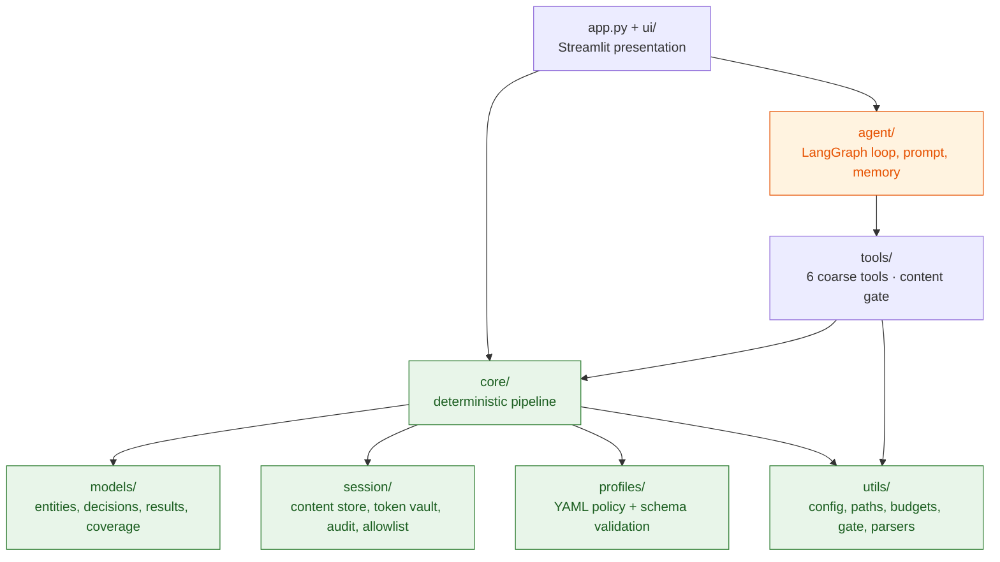
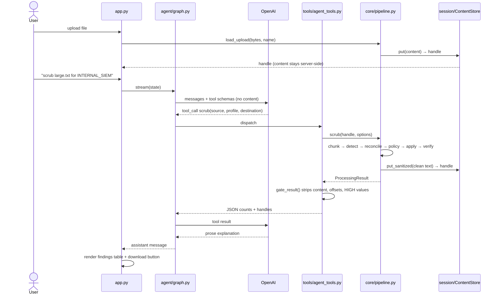
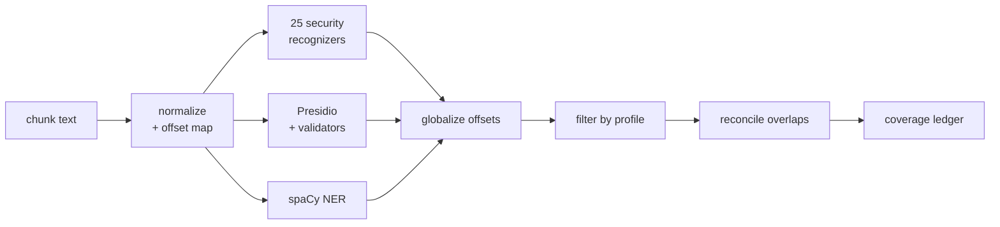

# Code Structure, Design and Flow

## Layer map

The package boundaries are the trust boundaries. Nothing in `pii_agent/core/` may import
from `pii_agent/agent/` or `pii_agent/tools/`, and that direction is enforced by test.



The orange box is the untrusted component. Everything green is deterministic and
LLM-free.

## Directory reference

| Path | Responsibility |
|---|---|
| `apps/pii_agent_app.py` | Streamlit entry point: upload, transcript, turn loop, result rendering |
| `pii_agent/ui/presenters.py` | Presentation logic with no Streamlit import, so it is testable |
| `pii_agent/ui/streamlit_render.py` | The drawing layer: findings table, refusals, downloads |
| `pii_agent/ui/health.py` | Startup and dependency health panel |
| `pii_agent/agent/graph.py` | `AgentRuntime`: LangGraph reasoning loop, budgets, tool dispatch |
| `pii_agent/agent/prompts.py` | System prompt, including what the agent cannot do |
| `pii_agent/agent/memory.py` | Transcript redaction, windowing, reference resolution |
| `pii_agent/agent/state.py` | `AgentState` typed dict and per-turn reset |
| `pii_agent/tools/agent_tools.py` | The six tools, source resolution, budget enforcement |
| `pii_agent/core/pipeline.py` | `scan` and `scrub`, and the three fail-closed gates |
| `pii_agent/core/file_source.py` | Ingestion: decode, parse, store, return a handle |
| `pii_agent/core/chunker.py` | Structural chunking with global offset mapping |
| `pii_agent/core/detector.py` | Runs the three detection engines |
| `pii_agent/core/recognizers.py` | 25 custom credential and secret recognizers |
| `pii_agent/core/reconciler.py` | Overlap resolution by credibility |
| `pii_agent/core/policy.py` | `PolicyEngine`: the monotonic ratchet |
| `pii_agent/core/applier.py` | Right-to-left replacement |
| `pii_agent/core/verifier.py` | Post-scrub re-scan |
| `pii_agent/core/injection_scan.py` | Prompt-injection pattern detection, reported not enforced |
| `pii_agent/core/profile_resolver.py` | Profile loading, inheritance, conflict resolution |
| `pii_agent/models/` | `Entity`, `Decision`, `DecisionSet`, `ProcessingResult`, `CoverageLedger`, enums |
| `pii_agent/session/context.py` | `SessionContext`: owns every mutable per-session store |
| `pii_agent/session/content_store.py` | Opaque handles; content never leaves the process |
| `pii_agent/session/token_vault.py` | Reversible tokenization and salted hashing |
| `pii_agent/session/audit_sink.py` | Append-only hash-chained JSONL |
| `pii_agent/session/allowlist.py` | Per-session false-positive suppression |
| `pii_agent/profiles/*.yaml` | Policy as data |
| `pii_agent/profiles/schema.py` | Profile validation, including forbidden action combinations |
| `pii_agent/utils/paths.py` | Sandbox containment with post-open verification |
| `pii_agent/utils/content_gate.py` | The only sanctioned path from core to the model |
| `pii_agent/utils/budgets.py` | Per-tool and per-turn wall-clock budgets |
| `pii_agent/utils/safe_parsers.py` | `defusedxml`-backed JSON/CSV/XML parsing |
| `pii_agent/utils/normalization.py` | Unicode normalization with an offset map back to the original |

## Request flow



Two details in that diagram carry most of the security weight. The bytes go from
`load_upload` straight into the `ContentStore` and never appear in a message. And
`gate_result` sits between the core and the model as the single sanctioned
crossing, validated structurally rather than by convention.

## The content gate

`pii_agent/utils/content_gate.py` checks every payload bound for the model against a
forbidden-key set: `content`, `text`, `value`, `matched_text`, `entity_text`,
`start`, `end`, `span`, `offset`, `positions`, `original`, `document` and others.
The check is structural and recursive, because the failure mode is silent — a
leaked offset looks like ordinary metadata.

It also redacts credential shapes as a backstop for anything that reached the
gate by an unexpected path, and shortens absolute filesystem paths to a bare
filename so directory layout is not disclosed. `sanitize_error` exists for the
same reason: parser and OS error messages routinely quote the input that caused
them.

## Detection and reconciliation



Two ordering decisions here were bug fixes, and reversing either reintroduces a
real defect.

**Profile filtering runs before reconciliation.** Otherwise a spaCy
`ORGANIZATION` guess can win an overlap against a checksum-validated `IBAN_CODE`
and then be dropped by the profile filter, losing the IBAN entirely.

**Precedence is credibility-first**, not longest-span-first: validator-backed,
then calibrated-versus-heuristic confidence, then severity, then length, then
detector precedence, then name. Length-first caused the bug above.

**A losing entity is trimmed, not discarded.** Presidio over-extends `PERSON` to
cover `"Priya Raghunathan ssn=417-82-6390"`. The nested SSN wins the overlap, and
discarding the loser whole left the name unscrubbed. The loser is reduced to its
uncovered remainder, with a 6-character threshold — shorter remainders are field
labels like `card=`, not values.

## Policy resolution

`pii_agent/core/policy.py` resolves each entity to exactly one action through a lattice:

```
ALLOW < REPLACE < MASK < HASH < TOKENIZE < REDACT < BLOCK
```

Resolution is `max()` over that priority map, taking the most restrictive of: the
profile's action for the type, any destination-specific override, and any action
the user requested. Because it is a `max`, a request can only ratchet upward.
This is what contains the blast radius of prompt injection.

`pii_agent/profiles/schema.py` rejects `HASH` for `US_SSN`, `CREDIT_CARD`, `CVV` and `PIN`
at load time. Those value spaces are small enough to exhaust — the SSN space is
about 10⁹ — so a salted digest is pseudonymization, not anonymization.

## Application and verification

The applier processes decisions in **descending start offset**. Replacements
change length, so left-to-right application invalidates every subsequent offset
after the first edit. Right-to-left keeps unprocessed offsets valid throughout.

Verification re-scans the output, scoped to the entity types the scan decided to
action, and accounts for types policy resolved to `ALLOW`. It also ignores
detections abutting a replaced region: masking a card leaves `card=` sitting
against asterisks, which spaCy reads as a `LOCATION`. That is our own replacement,
not a survivor, and without the exclusion gate 3 refused correct artifacts.

## Session ownership

Streamlit shares one process across every browser session, so anything mutable
held at module level leaks between users. Every mutable and sensitive store
therefore hangs off `SessionContext`, keyed by session id: the content store,
token vault, allowlist, audit sink, preferences and published results.

Content handles are `{namespace}:{128-bit hex}`, where the namespace is a hash of
the session id. The namespace is compared on every resolution using
`hmac.compare_digest`, so a handle issued in one session cannot be resolved in
another. `HandleNotFoundError` deliberately does not distinguish "unknown" from
"belongs to someone else" — saying so would confirm the existence of another
session's data.

Only genuinely stateless, expensive objects are shared process-wide: the Presidio
analyzer and the loaded spaCy model, reached through an explicit accessor so the
sharing is visible at the call site.

## Budgets and cancellation

`PER_TOOL_TIMEOUT_SECONDS` is 180 and `PER_TURN_TIMEOUT_SECONDS` is 300. The turn
budget is rebuilt at the start of every turn, and tools are rebuilt with it so
they hold the current turn's budget rather than a stale one.

Cancellation is cooperative, checked between chunks rather than pre-emptive.
Killing a thread mid-scrub could leave a partially written artifact or a
half-updated coverage ledger, so the flag is only tested where state is
consistent.

## Audit trail

Every run appends a JSONL record chained by hash: each record stores the hash of
its predecessor, so removing, reordering or editing a record breaks the chain and
`verify_chain` reports the first bad request id. Records carry entity counts, a
SHA-256 hash of the source identifier rather than the identifier itself, the
profile name and version, and the resolved engine and model versions. There is
deliberately no field capable of holding an entity value.
